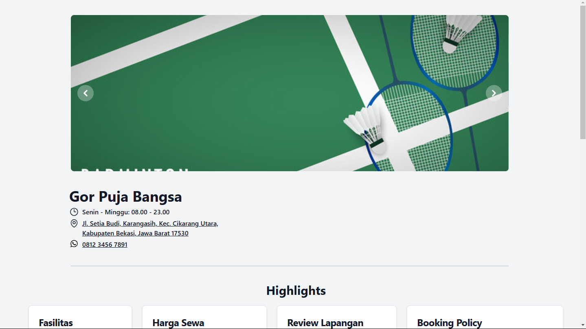

# Badminton Court Booking v1.0.0



### Table of Contents

-   [About the Project](#about-the-project)
-   [Features](#features)
-   [Installation](#installation)
-   [Usage](#usage)
-   [Roadmap](#roadmap)
-   [Fun Fact](#fun-fact)
-   [Contact](#contact)

### About the Project

This project using Laravel and Filament as tools. in this project you can see schedule that has been set by admin. admin also can see, add, edit and delete data.

### Features

-   Signin
-   CRUD

### Installation

Install the project from GitHub using the terminal:

```bash
git clone https://github.com/iannn4u/pro_badminton-court-booking.git
cd pro_onlineBanking
npm i && composer i
cp .env.example .env
php artisan key:generate
php artisan migrate --seed
php artisan make:filament-user
php artisan ser
npm run dev
php artisan cache:clear
php artisan config:clear
php artisan route:clear
php artisan view:clear
php artisan event:clear
php artisan optimize:clear
php artisan config:cache
php artisan route:cache
php artisan icons:cache
```

### Usage

1. Turn on your web server and mysql.
2. Open your web browser and type link from terminal.
3. And then you can explore all of features.

### Roadmap

-   Improve the design.
-   Make a payment

### Fun Fact

-   First time I use filament.

### Contact

For contact

-   Github: @iannn4u
-   Email: alandriansuryatantra@gmail.com

Project link: https://github.com/iannn4u/pro_badminton-court-booking
